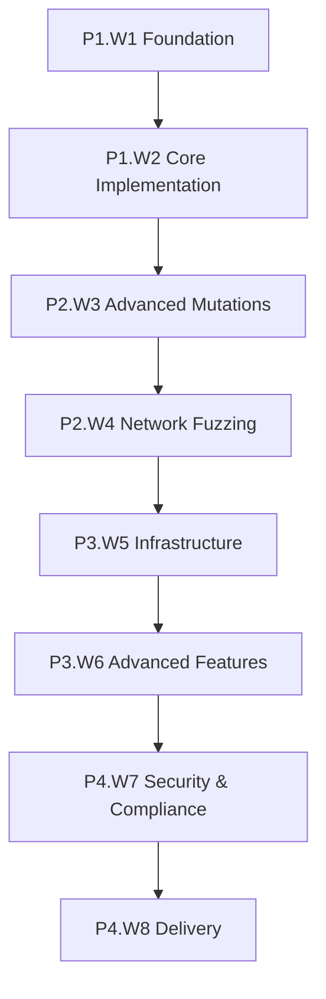

# DICOM-Fuzzer Task Breakdown Structure

## Overview

This document provides a detailed breakdown of tasks organized by project phases, with priorities, dependencies, and estimated effort. Each task includes acceptance criteria and assignee responsibilities.

## Phase 1: Foundation (Weeks 1-2)

### Week 1 Tasks ✅ COMPLETED

| Task ID  | Component | Task                                           | Priority | Effort   | Status      |
| -------- | --------- | ---------------------------------------------- | -------- | -------- | ----------- |
| P1.W1.T1 | Core      | Implement DicomParser with security validation | Critical | 3 days   | ✅ Complete |
| P1.W1.T2 | Core      | Create exception handling framework            | High     | 1 day    | ✅ Complete |
| P1.W1.T3 | CLI       | Basic command-line interface                   | Medium   | 1 day    | ✅ Complete |
| P1.W1.T4 | Config    | Basic configuration structure                  | Low      | 0.5 days | ✅ Complete |

### Week 2 Tasks 🔨 IN PROGRESS

#### Critical Path Tasks

| Task ID  | Component | Task                                 | Priority | Effort   | Dependencies | Acceptance Criteria                                                                                     |
| -------- | --------- | ------------------------------------ | -------- | -------- | ------------ | ------------------------------------------------------------------------------------------------------- |
| P1.W2.T1 | Core      | Complete mutator.py implementation   | Critical | 2 days   | P1.W1.T1     | • Centralized mutation coordination • Strategy pattern implementation • Mutation history tracking |
| P1.W2.T2 | Core      | Complete validator.py implementation | Critical | 1.5 days | P1.W2.T1     | • Output validation framework • DICOM compliance checking • Security validation                   |
| P1.W2.T3 | Utils     | Implement structured logger.py       | High     | 1 day    | -            | • Structured JSON logging • Security event tracking • Performance metrics                         |

#### Fuzzing Strategy Tasks

| Task ID  | Component  | Task                          | Priority | Effort   | Dependencies | Acceptance Criteria                                                                            |
| -------- | ---------- | ----------------------------- | -------- | -------- | ------------ | ---------------------------------------------------------------------------------------------- |
| P1.W2.T4 | Strategies | Enhance metadata_fuzzer.py    | High     | 1 day    | P1.W2.T1     | • Advanced patient data generation • Institutional data fuzzing • Date/time manipulation |
| P1.W2.T5 | Strategies | Enhance header_fuzzer.py      | High     | 1 day    | P1.W2.T1     | • VR boundary testing • Missing tag scenarios • Invalid value generation                 |
| P1.W2.T6 | Strategies | Enhance pixel_fuzzer.py       | High     | 1 day    | P1.W2.T1     | • Bit-level mutations • Compression artifact simulation • Noise injection algorithms     |
| P1.W2.T7 | Strategies | Implement structure_fuzzer.py | Medium   | 1.5 days | P1.W2.T1     | • File header corruption • Tag ordering attacks • Length field manipulation              |

#### Testing Infrastructure

| Task ID  | Component | Task                          | Priority | Effort | Dependencies | Acceptance Criteria                                                              |
| -------- | --------- | ----------------------------- | -------- | ------ | ------------ | -------------------------------------------------------------------------------- |
| P1.W2.T8 | Tests     | Comprehensive unit test suite | Critical | 2 days | P1.W2.T1-T7  | • ≥95% code coverage • Property-based testing • Security test cases        |
| P1.W2.T9 | Tests     | Integration test framework    | High     | 1 day  | P1.W2.T8     | • End-to-end workflows • File generation validation • Error handling tests |

#### Supporting Tasks

| Task ID   | Component | Task                          | Priority | Effort   | Dependencies | Acceptance Criteria                                                                |
| --------- | --------- | ----------------------------- | -------- | -------- | ------------ | ---------------------------------------------------------------------------------- |
| P1.W2.T10 | Utils     | Implement helpers.py          | Medium   | 0.5 days | -            | • Common utility functions • Data validation helpers • File system utilities |
| P1.W2.T11 | CLI       | Enhanced command-line options | Medium   | 0.5 days | P1.W2.T1     | • Strategy selection • Verbose logging • Configuration file support          |
| P1.W2.T12 | Docs      | API documentation foundation  | Low      | 1 day    | P1.W2.T1-T7  | • Docstring standards • Type annotations • Usage examples                    |

## Phase 2: Advanced Fuzzing (Weeks 3-4)

### Week 3: Intelligent Mutations

| Task ID  | Component  | Task                              | Priority | Effort   | Dependencies | Acceptance Criteria                                                                                  |
| -------- | ---------- | --------------------------------- | -------- | -------- | ------------ | ---------------------------------------------------------------------------------------------------- |
| P2.W3.T1 | Core       | Grammar-based mutation engine     | Critical | 3 days   | P1.W2.T1     | • DICOM structure understanding • Context-aware mutations • Valid/invalid structure generation |
| P2.W3.T2 | Core       | Coverage-guided fuzzing framework | High     | 2 days   | P2.W3.T1     | • Code path tracking • Mutation feedback loop • Coverage metrics                               |
| P2.W3.T3 | Core       | Crash analysis and reporting      | High     | 2 days   | P2.W3.T1     | • Automatic crash detection • Stack trace analysis • Reproduction case generation              |
| P2.W3.T4 | Strategies | Protocol-specific fuzzing         | Medium   | 1.5 days | P2.W3.T1     | • Service class mutations • Message flow fuzzing • Timing attack vectors                       |

### Week 4: Network & Discovery

| Task ID  | Component | Task                           | Priority | Effort | Dependencies | Acceptance Criteria                                                                        |
| -------- | --------- | ------------------------------ | -------- | ------ | ------------ | ------------------------------------------------------------------------------------------ |
| P2.W4.T1 | Network   | DICOM service discovery        | Critical | 2 days | P2.W3.T4     | • Automated service enumeration • Port scanning integration • Service fingerprinting |
| P2.W4.T2 | Network   | Upper Layer Protocol fuzzing   | Critical | 2 days | P2.W4.T1     | • Association handling • PDU manipulation • Connection lifecycle testing             |
| P2.W4.T3 | Core      | Multi-target fuzzing framework | High     | 2 days | P2.W4.T1     | • Concurrent target handling • Campaign management • Resource allocation             |
| P2.W4.T4 | Core      | Performance optimization       | Medium   | 1 day  | P2.W4.T3     | • Memory usage optimization • Parallel processing • Caching strategies               |

## Phase 3: Integration & Scalability (Weeks 5-6)

### Week 5: Infrastructure

| Task ID  | Component  | Task                             | Priority | Effort   | Dependencies | Acceptance Criteria                                                      |
| -------- | ---------- | -------------------------------- | -------- | -------- | ------------ | ------------------------------------------------------------------------ |
| P3.W5.T1 | DevOps     | CI/CD pipeline setup             | Critical | 2 days   | P2.W4.T4     | • Automated testing • Security scanning • Deployment automation    |
| P3.W5.T2 | DevOps     | Docker containerization          | High     | 1.5 days | P3.W5.T1     | • Isolated environments • Multi-stage builds • Security hardening  |
| P3.W5.T3 | Monitoring | Performance monitoring system    | High     | 1.5 days | P3.W5.T2     | • Real-time metrics • Alert mechanisms • Dashboard integration     |
| P3.W5.T4 | Core       | Distributed fuzzing architecture | Medium   | 2 days   | P3.W5.T3     | • Multi-node coordination • Work distribution • Result aggregation |

### Week 6: Advanced Features

| Task ID  | Component | Task                              | Priority | Effort   | Dependencies | Acceptance Criteria                                                           |
| -------- | --------- | --------------------------------- | -------- | -------- | ------------ | ----------------------------------------------------------------------------- |
| P3.W6.T1 | UI        | Web dashboard development         | High     | 2.5 days | P3.W5.T3     | • Campaign management • Results visualization • Real-time monitoring    |
| P3.W6.T2 | Core      | DICOM-RT support                  | Medium   | 1.5 days | P3.W6.T1     | • Radiotherapy structures • RT-specific mutations • Safety constraints  |
| P3.W6.T3 | Docs      | API documentation generation      | High     | 1 day    | P3.W6.T1     | • Sphinx integration • Auto-generated docs • Interactive examples       |
| P3.W6.T4 | Config    | Advanced configuration management | Low      | 1 day    | P3.W6.T2     | • Environment-specific configs • Validation and schemas • Hot reloading |

## Phase 4: Production Readiness (Weeks 7-8)

### Week 7: Security & Compliance

| Task ID  | Component  | Task                              | Priority | Effort   | Dependencies | Acceptance Criteria                                                               |
| -------- | ---------- | --------------------------------- | -------- | -------- | ------------ | --------------------------------------------------------------------------------- |
| P4.W7.T1 | Security   | Security hardening implementation | Critical | 2 days   | P3.W6.T4     | • SAST/DAST integration • Dependency scanning • Vulnerability remediation   |
| P4.W7.T2 | Compliance | Healthcare compliance validation  | Critical | 2 days   | P4.W7.T1     | • HIPAA compliance • FDA requirements • EU MDR adherence                    |
| P4.W7.T3 | Security   | Penetration testing execution     | High     | 1.5 days | P4.W7.T2     | • External security audit • Vulnerability assessment • Remediation planning |
| P4.W7.T4 | Security   | Access control implementation     | Medium   | 1.5 days | P4.W7.T3     | • User authentication • Role-based access • Audit logging                   |

### Week 8: Delivery

| Task ID  | Component | Task                           | Priority | Effort   | Dependencies | Acceptance Criteria                                                              |
| -------- | --------- | ------------------------------ | -------- | -------- | ------------ | -------------------------------------------------------------------------------- |
| P4.W8.T1 | Testing   | Field testing and validation   | Critical | 2 days   | P4.W7.T4     | • Real-world scenarios • Performance validation • User acceptance testing  |
| P4.W8.T2 | UI        | Production-ready interface     | High     | 1.5 days | P4.W8.T1     | • User experience optimization • Error handling • Accessibility compliance |
| P4.W8.T3 | Docs      | Complete documentation suite   | High     | 1.5 days | P4.W8.T2     | • User guides • Installation instructions • Troubleshooting guide          |
| P4.W8.T4 | Training  | Training materials and support | Medium   | 1 day    | P4.W8.T3     | • Video tutorials • Best practices guide • Support documentation           |

## Task Dependencies Visualization

## Critical Path Analysis

### Primary Critical Path (32 days)

1. **P1.W2.T1**: Core Mutator (2 days) → **BLOCKING**
2. **P1.W2.T2**: Core Validator (1.5 days)
3. **P1.W2.T8**: Test Suite (2 days)
4. **P2.W3.T1**: Grammar-based Mutations (3 days)
5. **P2.W4.T1**: Service Discovery (2 days)
6. **P2.W4.T2**: Protocol Fuzzing (2 days)
7. **P3.W5.T1**: CI/CD Pipeline (2 days)
8. **P3.W6.T1**: Web Dashboard (2.5 days)
9. **P4.W7.T1**: Security Hardening (2 days)
10. **P4.W7.T2**: Compliance Validation (2 days)
11. **P4.W8.T1**: Field Testing (2 days)

### Risk Mitigation Strategies

| Risk Area                      | Mitigation Tasks            | Buffer Time |
| ------------------------------ | --------------------------- | ----------- |
| **Core Implementation Delays** | Parallel fuzzer development | 1 day       |
| **Network Integration Issues** | Early protocol testing      | 0.5 days    |
| **Security Scan Failures**     | Continuous security testing | 1 day       |
| **Compliance Validation**      | Regular compliance reviews  | 1 day       |

## Resource Allocation

### Developer Time Distribution

- **Phase 1**: 35% (Foundation & Core)
- **Phase 2**: 30% (Advanced Features)
- **Phase 3**: 20% (Integration & Scaling)
- **Phase 4**: 15% (Production & Delivery)

### Skill Requirements by Phase

- **Phase 1-2**: Python expertise, DICOM knowledge, security awareness
- **Phase 3**: DevOps skills, containerization, web development
- **Phase 4**: Security expertise, compliance knowledge, documentation

## Quality Checkpoints

### End of Week Reviews

- **Deliverable Demo**: Working features demonstration
- **Code Review**: Security and quality assessment
- **Test Coverage**: Minimum 95% coverage verification
- **Documentation**: Updated technical documentation

### Phase Gate Reviews

- **Stakeholder Approval**: Business requirements validation
- **Security Assessment**: Comprehensive security review
- **Performance Validation**: Performance benchmarks achievement
- **Compliance Check**: Regulatory requirements verification

---

**Document Control**

- **Version**: 1.0
- **Created**: 2025-09-15
- **Next Review**: Weekly task updates
- **Owner**: DICOM-Fuzzer Development Team
